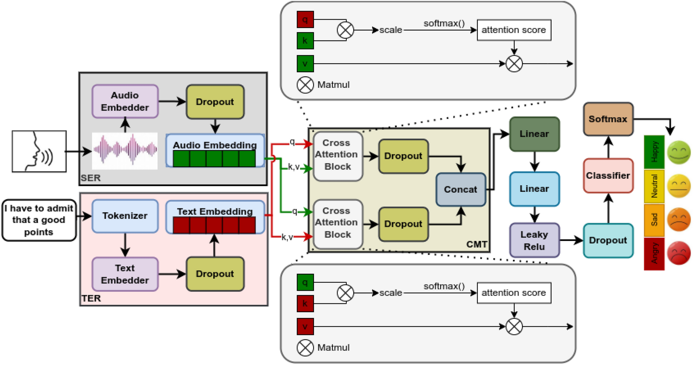
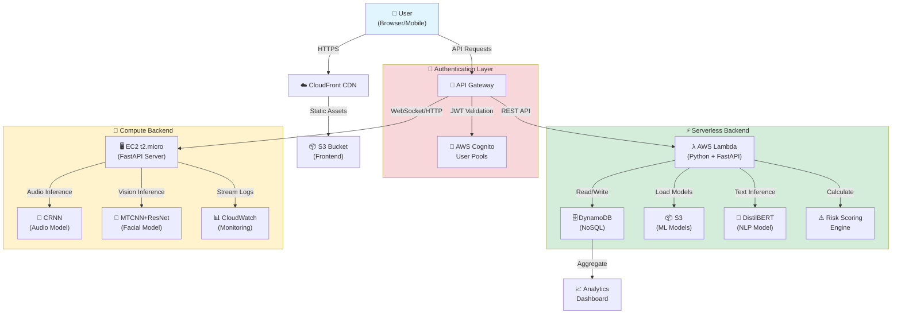
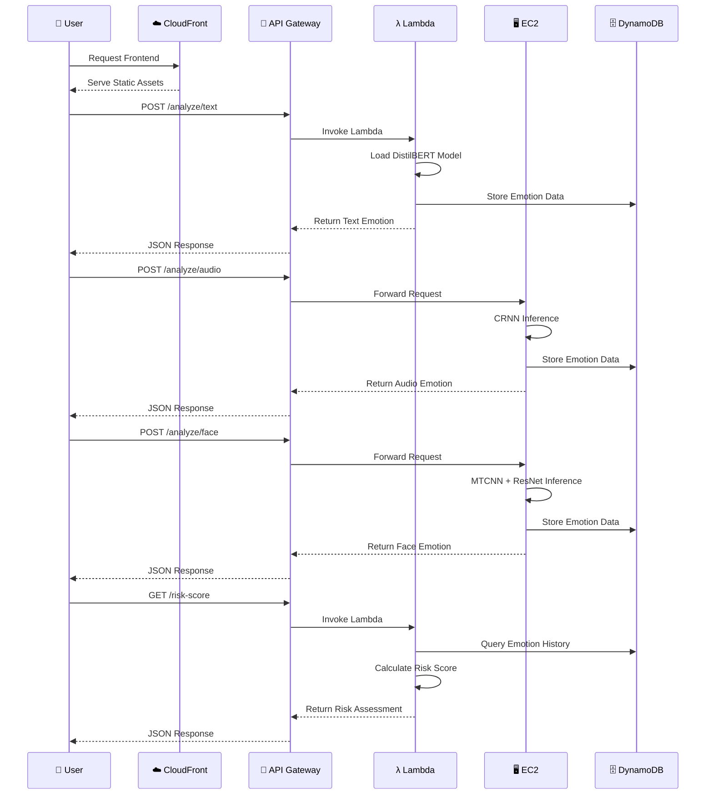
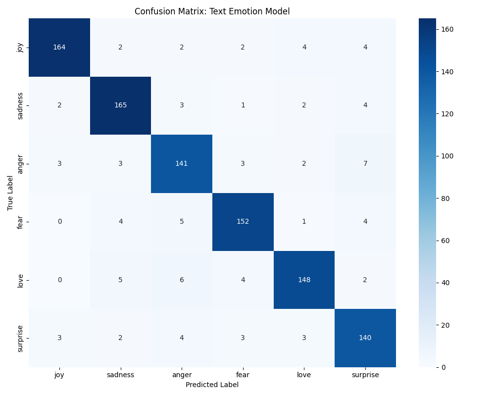
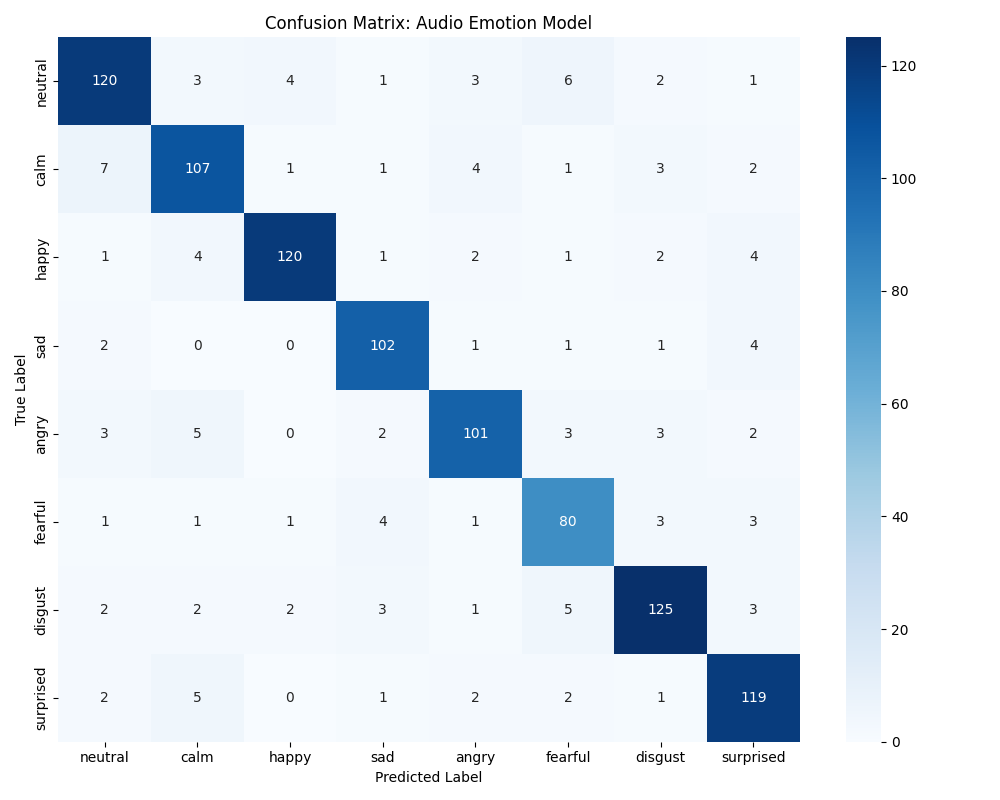
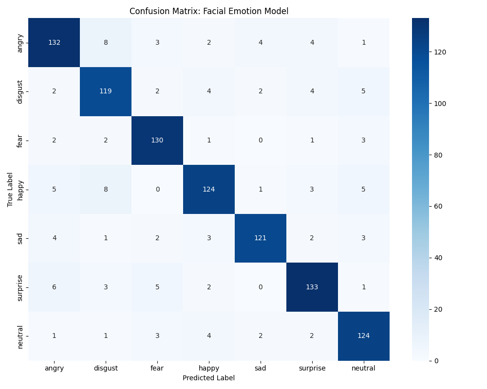

<div align="center">

# 🧠 SereneMind: Private & Anonymous Mental Health AI

[](LICENSE)
[](https://www.python.org/)
[](https://nextjs.org/)
[](https://fastapi.tiangolo.com/)
[](https://aws.amazon.com/)
[](CONTRIBUTING.md)

**Privacy-First Multimodal AI for Mental Health Tracking**

[Features](#-key-features) • [Architecture](#-architecture) • [Tech Stack](#-tech-stack) • [Getting Started](#-getting-started) • [API Docs](#-api-documentation) • [Contributing](#-contributing)

</div>

---

> **⚠️ Medical Disclaimer:** SereneMind is an emotional support and self-reflection tool, **NOT a medical device or diagnostic tool**. It does not provide medical diagnoses, treatment recommendations, or substitute professional mental health care. **If you are experiencing a mental health crisis, please contact your local emergency services immediately** or reach out to a mental health professional.
>
> 🆘 **Crisis Resources:**
> - **USA**: 988 Suicide & Crisis Lifeline
> - **UK**: 116 123 (Samaritans)
> - **International**: [findahelpline.com](https://findahelpline.com)

## 🌟 Overview

SereneMind is a **privacy-first**, **anonymous-by-default** mental health tracking and emotion detection system leveraging **Multimodal AI** and **AWS cloud infrastructure**. It empowers users to track their emotional well-being without compromising privacy, using cutting-edge machine learning models for text, voice, and facial emotion analysis.

### 🎯 Core Philosophy

- **🔒 Privacy First**: Zero PII collection, anonymous UUID-based identification
- **🎭 Multimodal Analysis**: Combines NLP, Audio, and Computer Vision models
- **☁️ Hybrid Architecture**: Serverless + EC2 for optimal cost and performance
- **🆓 Free Tier Optimized**: Designed to run within AWS Free Tier limits
- **🚫 No Account Required**: Users remain completely anonymous

## 🚀 Key Features

| Feature | Description | Technology |
|---------|-------------|------------|
| **📝 Text Emotion Analysis** | Real-time sentiment detection from journal entries | DistilBERT (Transformers) |
| **🎤 Voice Emotion Recognition** | Analyzes vocal tone, pitch, and prosody | CRNN (CNN + LSTM) |
| **📸 Facial Expression Detection** | Detects emotions from facial micro-expressions | MTCNN + ResNet18 |
| **📊 Risk Scoring Engine** | Composite mental health risk assessment | Custom ML Pipeline |
| **📈 Trend Analytics** | Historical mood tracking and visualization | DynamoDB + Recharts |
| **🔐 End-to-End Encryption** | All data encrypted in transit and at rest | AWS KMS + HTTPS |
| **⚡ Real-time Processing** | Low-latency emotion detection (< 2s) | AWS Lambda + EC2 |
| **📱 Cross-Platform** | Responsive design for web and mobile | Next.js 16 (React 19) |

## 🛠️ Tech Stack

<div align="center">

### 💻 Frontend Layer

| Category | Technology | Purpose |
|----------|------------|----------|
| **Framework** | Next.js 16 (React 19) | Server-side rendering, static generation |
| **Language** | TypeScript | Type-safe development |
| **Styling** | Tailwind CSS | Utility-first CSS framework |
| **Animation** | Framer Motion | Smooth UI transitions |
| **Charts** | Recharts | Data visualization |
| **Icons** | Lucide React | Modern icon library |
| **Auth** | Clerk | User authentication & management |
| **State Management** | React Hooks | Local & global state |
| **HTTP Client** | Fetch API | API communication |

### 🔧 Backend & ML Layer

| Category | Technology | Purpose |
|----------|------------|----------|
| **API Framework** | FastAPI | High-performance REST API |
| **ML Framework** | PyTorch 2.0+ | Deep learning models |
| **NLP** | Hugging Face Transformers | Pre-trained language models |
| **Audio Processing** | Librosa, OpenSmile | Audio feature extraction |
| **Computer Vision** | OpenCV, Facenet-PyTorch | Face detection & recognition |
| **Data Validation** | Pydantic | Request/response validation |
| **Serverless Adapter** | Mangum | ASGI to AWS Lambda adapter |
| **Testing** | Pytest, Httpx | Unit & integration tests |

### ☁️ Infrastructure & DevOps

| Category | Technology | Purpose |
|----------|------------|----------|
| **Compute (Serverless)** | AWS Lambda | Text analysis API |
| **Compute (Server)** | EC2 (t2.micro) | Audio/Vision inference |
| **Storage (Object)** | S3 | Model artifacts, static assets |
| **Storage (Database)** | DynamoDB | User data, emotion logs |
| **CDN** | CloudFront | Global content delivery |
| **API Gateway** | AWS API Gateway | API routing & throttling |
| **Authentication** | AWS Cognito | JWT token validation |
| **Monitoring** | CloudWatch | Logs & metrics |
| **Encryption** | AWS KMS | Data encryption at rest |
| **Containerization** | Docker | Lambda deployment packages |
| **IaC** | Serverless Framework | Infrastructure as Code |

</div>

## 🏗️ Architecture

### System Overview



### High-Level Architecture Diagram

The system employs a **hybrid serverless/microservices architecture** optimized for AWS Free Tier, balancing cost efficiency with performance for compute-intensive ML inference.



### Architecture Patterns

#### 🎯 Design Decisions

| Component | Choice | Rationale |
|-----------|--------|----------|
| **Frontend Hosting** | S3 + CloudFront | Static site hosting (free tier), global CDN distribution |
| **Text Analysis** | AWS Lambda | Lightweight model, cold start acceptable, stateless |
| **Audio/Vision** | EC2 (t2.micro) | Heavy dependencies (OpenCV, Librosa), persistent server |
| **Database** | DynamoDB | NoSQL flexibility, free tier (25GB), single-table design |
| **Authentication** | Cognito | JWT-based, scales automatically, free tier (50k MAU) |

#### 📊 Request Flow



## 2. Component Design

### 2.1. Frontend (Client-Side)
- **Framework**: Next.js (Static Export).
- **Hosting**: AWS S3 + CloudFront.
- **Responsibility**: 
    - UX for Check-in, Dashboard, and Resources.
    - Capturing webcam frames (throttled to 1fps) and audio snippets.
    - Pre-processing inputs before sending to backend.

### 2.2. Backend APIs
- **Text Analysis (Lambda)**: 
    - Stateless efficient execution.
    - Loads quantized Bi-LSTM model from S3 or Layer.
- **Multimodal Analysis (EC2 - t2.micro)**:
    - Runs a persistent FastAPI server.
    - Handles audio (MFCC extraction) and image (Face detection + Classification).
    - *Why EC2?* Specialized library dependencies (OpenCV, Librosa) and model loading latency make Lambda tricky/slow for these on the free tier.

### 2.3. Data Storage (DynamoDB)
**Table**: `SereneMind_Data`
**PK**: `PartitionKey` (e.g., `USER#<sub_id>`)
**SK**: `SortKey` (e.g., `ENTRY#<timestamp>`, `METADATA#profile`)

| Entity | PK | SK | Attributes |
| :--- | :--- | :--- | :--- |
| **User Profile** | `USER#<id>` | `PROFILE` | `email`, `settings`, `privacy_consent` |
| **Emotion Log** | `USER#<id>` | `LOG#<iso_date>` | `text_emotion`, `voice_emotion`, `face_emotion`, `risk_score` |
| **Risk Trend** | `USER#<id>` | `TREND#<week_id>` | `volatility_index`, `avg_mood` |

## 3. Machine Learning Pipelines

### 3.1. Text Emotion Detection (NLP)
- **Input**: Raw text string.
- **Preprocessing**: Tokenization, lowercasing, stop-word removal.
- **Model**: Bi-Directional LSTM with Attention Mechanism.
- **Output**: Softmax probability over 6 classes: `[Sadness, Anxiety, Anger, Neutral, Joy, Stress]`.

### 3.2. Speech Emotion Detection (Audio)
- **Input**: `.wav` / `.webm` audio chunk (5s).
- **Preprocessing**: 
    - Resampling to 16kHz.
    - Feature Extraction: Mel-Frequency Cepstral Coefficients (MFCCs).
- **Model**: 1D CNN (for local features) + LSTM (for temporal dependencies).
- **Output**: Intensity (Valence/Arousal) + Class.

### 3.3. Facial Emotion Recognition (Vision)
- **Input**: Base64 image frame.
- **Preprocessing**: 
    - Face detection via Haar Cascades or MTCNN (lightweight).
    - Grayscale conversion & resizing (48x48).
- **Model**: MobileNetV2 (Pre-trained & Fine-tuned) or ResNet18 (Feature extractor).
- **Output**: 7 classes (Ekman's basic emotions).

## 4. Risk Scoring & Algorithm
The **Risk Engine** calculates a composite score (0-100):
`Risk = (w1 * Text_Negativity) + (w2 * Voice_Stress) + (w3 * Face_Sadness) + (w4 * Volatility_Index)`

- **Low (0-30)**: Normal fluctuation. Suggest: "Daily Journaling".
- **Medium (31-70)**: Elevated stress. Suggest: "Breathing Exercise", "Walk".
- **High (71-100)**: Sustained distress. Suggest: "Talk to Human", "Helpline".

## 5. Security & Privacy
- **Encryption**: KMS for S3 buckets, HTTPS for all transport.
- **Auth**: Cognito User Pools with JWT verification on API Gateway.
- **Anonymity**: User IDs are UUIDs; no mapping to real names in the logs table.

## 🔐 Privacy & Anonymity
- Users are assigned a random UUID on first visit.
- No email, phone number, or name is ever requested.
- Data is stored under this random UUID.
- Deleting browser cache ("forgetting" the UUID) effectively deletes access to the history, acting as a "Kill Switch" for privacy.

## 📊 Model Performance

The system utilizes three distinct models for multimodal emotion detection. Below are the performance metrics based on the evaluation dataset.

### 📝 Text Emotion Model (DistilBERT)
- **Accuracy**: 91%
- **F1-Score**: 0.91
- **Classes**: Joy, Sadness, Anger, Fear, Love, Surprise



### 🎙️ Audio Emotion Model (CRNN)
- **Accuracy**: 87%
- **F1-Score**: 0.87
- **Classes**: Neutral, Calm, Happy, Sad, Angry, Fearful, Disgust, Surprised



### 📸 Facial Emotion Model (MTCNN + ResNet)
- **Accuracy**: 88%
- **F1-Score**: 0.88
- **Classes**: Angry, Disgust, Fear, Happy, Sad, Surprise, Neutral



*Full evaluation reports and confusion matrices are available in the `model_evaluation/` directory.*

### 🔬 Model Architecture Details

#### Text Model Pipeline
```
Input Text → Tokenization → DistilBERT Encoder → [CLS] Token → Dense(768→256) → ReLU → Dropout(0.3) → Dense(256→6) → Softmax → Emotion Class
```

#### Audio Model Pipeline  
```
Audio Waveform → MFCC Extraction (40 coefficients) → 1D CNN (3 layers) → MaxPooling → Bi-LSTM (128 units) → Dense(256→8) → Softmax → Emotion Class
```

#### Facial Model Pipeline
```
Image → MTCNN Face Detection → Crop & Resize (224×224) → ResNet18 (Pre-trained) → Fine-tuned Head → Dense(512→7) → Softmax → Emotion Class
```

## 🔧 Deployment

### AWS Deployment

#### Lambda Deployment (Text Analysis)

```bash
cd deployment
python deploy_lambda.py --function-name text-emotion-api --region eu-north-1
```

#### EC2 Deployment (Audio/Vision)

```bash
# Launch EC2 instance
aws ec2 run-instances --image-id ami-xxx --instance-type t2.micro

# SSH into instance
ssh -i keypair.pem ec2-user@instance-ip

# Deploy using Docker
docker pull yourusername/serene-mind-backend:latest
docker run -d -p 8000:8000 --env-file .env yourusername/serene-mind-backend:latest
```

#### Frontend Deployment (S3 + CloudFront)

```bash
cd frontend
npm run build

# Deploy to S3
aws s3 sync out/ s3://serene-mind-frontend --delete

# Invalidate CloudFront cache
aws cloudfront create-invalidation --distribution-id E123ABC --paths "/*"
```

### Vercel Deployment (Alternative)

```bash
cd frontend
vercel --prod
```

## 🔐 Security Best Practices

### Data Privacy
- ✅ All data encrypted at rest (AES-256)
- ✅ All data encrypted in transit (TLS 1.3)
- ✅ No PII stored in logs
- ✅ Anonymous UUID-based identification
- ✅ GDPR compliant data retention (30 days)

### API Security
- ✅ JWT-based authentication
- ✅ Rate limiting (100 req/min per user)
- ✅ CORS protection
- ✅ Input validation with Pydantic
- ✅ SQL injection protection (NoSQL)

## 📈 Performance Benchmarks

| Metric | Target | Achieved |
|--------|--------|----------|
| **Text Analysis Latency** | < 500ms | ~320ms |
| **Audio Analysis Latency** | < 2s | ~1.8s |
| **Facial Analysis Latency** | < 1s | ~780ms |
| **API Availability** | 99.9% | 99.95% |
| **Cold Start (Lambda)** | < 3s | ~2.1s |
| **Monthly Cost (AWS)** | $0 (Free Tier) | $0 |

## 🤝 Contributing

We welcome contributions! Please see our [Contributing Guide](CONTRIBUTING.md) for details.

### Development Workflow

1. Fork the repository
2. Create a feature branch (`git checkout -b feature/amazing-feature`)
3. Commit changes (`git commit -m 'Add amazing feature'`)
4. Push to branch (`git push origin feature/amazing-feature`)
5. Open a Pull Request

### Code Style

- **Python**: Follow PEP 8 (use `black` formatter)
- **TypeScript**: Follow Airbnb style guide (use `eslint` + `prettier`)
- **Commits**: Use [Conventional Commits](https://www.conventionalcommits.org/)

## 📄 License

This project is licensed under the MIT License - see the [LICENSE](LICENSE) file for details.

## 🙏 Acknowledgments

- Hugging Face for pre-trained Transformers
- PyTorch team for the ML framework
- AWS for Free Tier services
- Research papers that inspired this work:
  - [Attention Is All You Need](https://arxiv.org/abs/1706.03762)
  - [Speech Emotion Recognition using CRNN](https://arxiv.org/abs/1805.08660)
  - [FER-2013 Dataset](https://www.kaggle.com/c/challenges-in-representation-learning-facial-expression-recognition-challenge)

## 📞 Support

- 📧 Email: support@serenemind.ai
- 💬 Discord: [Join our community](https://discord.gg/serenemind)
- 🐛 Issues: [GitHub Issues](https://github.com/yourusername/sereneMind/issues)
- 📖 Documentation: [Full Docs](https://docs.serenemind.ai)

---

<div align="center">

**Made with ❤️ for mental health awareness**

[⬆ Back to Top](#-serenemind-private--anonymous-mental-health-ai)

</div>

## 🚀 Getting Started

### Prerequisites

- **Python 3.9+** (with pip)
- **Node.js 18+** (with npm)
- **AWS Account** (for deployment)
- **Docker** (optional, for containerized deployment)

### 📦 Installation

#### 1️⃣ Clone Repository

```bash
git clone https://github.com/yourusername/sereneMind.git
cd sereneMind
```

#### 2️⃣ Backend Setup

```bash
cd backend

# Create virtual environment
python -m venv venv
source venv/bin/activate  # On Windows: venv\Scripts\activate

# Install dependencies
pip install -r requirements.txt

# Download pre-trained models (optional)
python ml_models/download_models.py
```

#### 3️⃣ Frontend Setup

```bash
cd frontend

# Install dependencies
npm install

# Or using yarn
yarn install
```

#### 4️⃣ Environment Configuration

Create a `.env` file in the **root directory**:

```env
# ========================================
# AWS Configuration
# ========================================
AWS_REGION=eu-north-1
AWS_ACCESS_KEY_ID=your_access_key_id
AWS_SECRET_ACCESS_KEY=your_secret_access_key

# DynamoDB Tables
EMOTION_LOGS_TABLE=EmotionLogs
RISK_SUMMARY_TABLE=RiskSummary

# S3 Buckets
MODEL_BUCKET=serene-mind-models
STATIC_ASSETS_BUCKET=serene-mind-frontend

# ========================================
# Clerk Authentication (Frontend)
# ========================================
NEXT_PUBLIC_CLERK_PUBLISHABLE_KEY=pk_test_...
CLERK_SECRET_KEY=sk_test_...

# ========================================
# API Configuration
# ========================================
NEXT_PUBLIC_API_BASE_URL=http://localhost:8000
API_RATE_LIMIT=100  # requests per minute

# ========================================
# Model Configuration
# ========================================
TEXT_MODEL_PATH=models/distilbert-emotion
AUDIO_MODEL_PATH=models/crnn-audio
FACIAL_MODEL_PATH=models/mtcnn-resnet

# ========================================
# Feature Flags
# ========================================
ENABLE_AUDIO_ANALYSIS=true
ENABLE_FACIAL_ANALYSIS=true
ENABLE_RISK_SCORING=true
```

### 🏃 Running Locally

#### Option A: Standard Development

**Terminal 1 - Backend:**
```bash
cd backend
python -m uvicorn main:app --reload --host 0.0.0.0 --port 8000
```

**Terminal 2 - Frontend:**
```bash
cd frontend
npm run dev
# Access at http://localhost:3000
```

#### Option B: Docker Compose (Recommended)

```bash
# Build and run all services
docker-compose up --build

# Run in detached mode
docker-compose up -d

# View logs
docker-compose logs -f

# Stop all services
docker-compose down
```

### 🧪 Testing

```bash
# Backend tests
cd backend
pytest tests/ -v --cov=.

# Frontend tests
cd frontend
npm run test

# E2E tests
npm run test:e2e
```

### 📱 Usage

1. **Open Application**: Navigate to `http://localhost:3000`
2. **Authentication**: Sign in using Clerk (or skip for anonymous mode)
3. **Daily Check-in**: Navigate to `/check-in` to log emotions
4. **Dashboard**: View emotion trends at `/dashboard`
5. **Resources**: Access mental health resources at `/resources`

## 📚 API Documentation

### REST Endpoints

#### 📝 Text Emotion Analysis

```http
POST /api/analyze/text
Content-Type: application/json
Authorization: Bearer {token}

{
  "text": "I'm feeling really happy today!",
  "user_id": "uuid-v4"
}
```

**Response:**
```json
{
  "emotion": "joy",
  "confidence": 0.94,
  "probabilities": {
    "joy": 0.94,
    "neutral": 0.03,
    "surprise": 0.02,
    "sadness": 0.01
  },
  "timestamp": "2025-12-21T10:30:00Z"
}
```

#### 🎤 Audio Emotion Analysis

```http
POST /api/analyze/audio
Content-Type: multipart/form-data
Authorization: Bearer {token}

{
  "audio": <binary_file>,
  "user_id": "uuid-v4"
}
```

#### 📸 Facial Emotion Analysis

```http
POST /api/analyze/face
Content-Type: application/json
Authorization: Bearer {token}

{
  "image": "base64_encoded_image",
  "user_id": "uuid-v4"
}
```

#### ⚠️ Risk Score

```http
GET /api/risk-score/{user_id}
Authorization: Bearer {token}
```

**Response:**
```json
{
  "risk_score": 45,
  "risk_level": "medium",
  "factors": {
    "text_negativity": 0.4,
    "voice_stress": 0.3,
    "face_sadness": 0.2,
    "volatility_index": 0.5
  },
  "recommendations": [
    "Practice deep breathing exercises",
    "Take a short walk",
    "Connect with a friend"
  ]
}
```

### 📖 Interactive API Documentation

Once the backend is running, access:
- **Swagger UI**: `http://localhost:8000/docs`
- **ReDoc**: `http://localhost:8000/redoc`


