# 🧠 Emotion Recognition & Mental Health Support System

> **⚠️ IMPORTANT: Production Readiness**
> Please refer to [PROBLEMS.md](./PROBLEMS.md) for a list of known issues, security gaps, and configuration steps required before deploying this project to production.

## 📋 Project Overview

This system is a comprehensive solution for monitoring and supporting student mental health through non-invasive emotion recognition. It combines a mobile app for students, a real-time AI voice agent for interaction, and web portals for counsellors and administrators.

### Key Features
- **Real-time Emotion Analysis**: Uses CNN-based models and LiveKit for real-time audio/video analysis.
- **AI Voice Companion**: A Python-based agent (powered by Gemini & Silero) that provides conversational support.
- **Risk Scoring**: Automated trend analysis to detect anomalies in emotional states.
- **Intervention System**: Triggers PHQ-9 / DASS-21 questionnaires based on risk scores.
- **Counsellor Dashboard**: A dedicated portal for reviewing cases and managing interventions.

---

## 🏗️ Architecture & Components

The project is organized into the following micro-services/applications:

| Folder | Component | Tech Stack | Description |
|--------|-----------|------------|-------------|
| `Student_app` | **Student Mobile App** | React Native (Expo) | The primary interface for students. Captures face landmarks, handles surveys, and connects to the AI agent. |
| `backend` | **Core API** | Node.js, Express | Handles authentication, data storage, and generates LiveKit tokens. |
| `Emotion_Engine` | **AI Worker** | Python, LiveKit Agents | Runs the real-time voice agent and emotion analysis models. |
| `councellor_portal` | **Counsellor Portal** | Next.js, Prisma, Postgres | Dashboard for mental health professionals to review student data. |
| `admin` | **Admin Dashboard** | Next.js | System configuration and user management. |
| `Analysis_engine` | **Trend Analysis** | Python | Scripts for calculating long-term emotional trends. |

---

## 🚀 Getting Started

### Prerequisites

Ensure you have the following installed:
- **Node.js** (v18 or higher)
- **pnpm** (Package Manager)
- **Python** (v3.9 or higher)
- **PostgreSQL** (Local or Cloud instance)
- **LiveKit** (Cloud account or local server)
- **Google Gemini API Key**

### 🛠️ Installation

#### Automated Setup (Windows)
You can use the provided PowerShell script to install dependencies for all projects:
```powershell
.\setup.ps1
```

#### Manual Setup
If you are on macOS/Linux or prefer manual installation:

1. **Backend**
   ```bash
   cd backend
   pnpm install
   ```

2. **Student App**
   ```bash
   cd Student_app
   pnpm install
   ```

3. **Emotion Engine (Python)**
   ```bash
   cd Emotion_Engine
   python -m venv .venv
   source .venv/bin/activate  # On Windows: .\.venv\Scripts\activate
   pip install -r requirements.txt
   ```

4. **Portals**
   ```bash
   cd admin && pnpm install
   cd ../councellor_portal && pnpm install
   ```

---

## ⚙️ Configuration

You must configure environment variables for each service. Create `.env` or `.env.local` files in the respective directories.

### 1. Backend (`backend/.env`)
```env
PORT=3000
LIVEKIT_API_KEY=your_key
LIVEKIT_API_SECRET=your_secret
LIVEKIT_URL=wss://your-project.livekit.cloud
```

### 2. Emotion Engine (`Emotion_Engine/.env`)
```env
LIVEKIT_URL=wss://your-project.livekit.cloud
LIVEKIT_API_KEY=your_key
LIVEKIT_API_SECRET=your_secret
GOOGLE_API_KEY=your_gemini_key
```

### 3. Student App (`Student_app/.env.local`)
```env
EXPO_PUBLIC_BACKEND_URL=http://localhost:3000  # Change to IP for device testing
EXPO_PUBLIC_LIVEKIT_URL=wss://your-project.livekit.cloud
```

---

## ▶️ Running the Project

To run the full system, you need to start multiple terminals.

### Terminal 1: Backend
```bash
cd backend
pnpm dev
```

### Terminal 2: Emotion Engine (AI Agent)
```bash
cd Emotion_Engine
# Ensure venv is activated
python worker/livekit_agent.py dev
```

### Terminal 3: Student App
```bash
cd Student_app
pnpm start
# Press 'a' for Android, 'i' for iOS, or scan QR code with Expo Go
```

### Terminal 4: Counsellor Portal
```bash
cd councellor_portal
pnpm dev
```

---

## 📊 System Diagrams

### Sequence Diagram

```mermaid
sequenceDiagram
    autonumber
    participant Student
    participant Device as Student Device
    participant API as Backend API
    participant EMO as Emotion Engine
    participant TREND as Trend Engine
    participant RISK as Risk Scoring
    participant FORM as Form Trigger
    participant COUNS as Counselor Portal

    Student ->> Device: Opens ERP App
    Device ->> Device: Capture Face Landmarks (MediaPipe + TF-Lite)
    Device ->> Device: Context-Aware Normalization
    Device ->> API: Send Encrypted Embeddings

    API ->> EMO: Forward embeddings
    EMO ->> EMO: Compute emotional indicators
    EMO ->> TREND: Send daily metrics

    TREND ->> TREND: Detect long-term anomalies
    TREND ->> RISK: Weekly risk scoring

    RISK ->> FORM: If elevated → trigger PHQ-9 / DASS-21
    FORM ->> Student: Show questionnaire inside ERP

    Student ->> API: Submit questionnaire
    API ->> COUNS: Escalate high-risk case
    COUNS ->> COUNS: Clinical evaluation workflow
```


### Class Diagram

